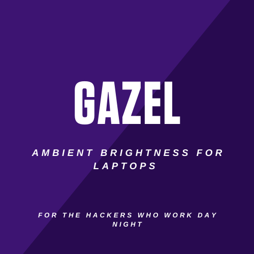

# Gazel
Ambient auto brightness tool for laptops and desktops. It adjusts the brightness of the screen based on the contrast between you and your background. 



## Installation

The project is under active development you can install the package directly form the github

```bash
 Pkg.clone("https://github.com/MLH-Fellowship/0.3.1-team-2-gazel.git")
 Pkg.build("gazel")
```

## Usage
usiage is pretty simple after installing just do the foolowing commad

```
julia> using gazel
```

## Technologies Used

All the work have been done in julia. We used the following julia projects:
- DifferentialEquations.jl from SciML
- Images.jl from JuliaImages
- VideoIO.jl

## Rules and Standards

### Pull Request
Please don't make a PR without any issue. If you make one, it will be closed. If you want to open a PR, please link it with the issue.

### Naming Branches
Name your branches something like this. But you don't need to strictly follow it if you are linking it with issue properly in PR

${issueNo}-#{yourGitHubName}

## License
MIT License 
